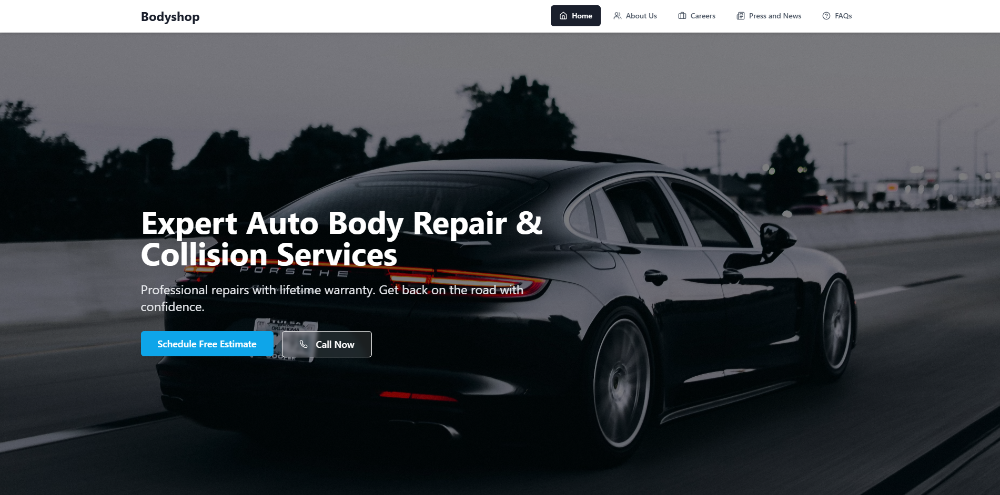

# Welcome to Your Body Shop Project 💪



## 🌐 Live Demo  
👉 [Click here to view the live demo](https://bodyshop-landing-genius-vgyx.vercel.app/)


## License

This project is protected under a proprietary license. Unauthorized commercial or non-commercial use is strictly prohibited. For licensing inquiries, please contact:

- Email: robbygrey1993@gmail.com
- WhatsApp: +1 (619) 967-7793

## 🚀 Getting Started

Follow these steps to set up and run the Body Shop website.

### Prerequisites
- Node.js & npm - [install with nvm](https://github.com/nvm-sh/nvm#installing-and-updating)

### 1️⃣ Clone the Repository
```sh
git clone <YOUR_GIT_URL>
```

### 2️⃣ Navigate to the Project Directory
```sh
cd <YOUR_PROJECT_NAME>
```

### 3️⃣ Install Dependencies
Make sure you have Node.js installed before running the following command:
```sh
npm install
```

### 4️⃣ Start the Development Server
This will launch the website locally with live updates:
```sh
npm run dev
```

### 5️⃣ (Optional) Build for Production
To generate optimized files for deployment:
```sh
npm run build
```

### 6️⃣ (Optional) Preview Production Build
To preview the production build locally:
```sh
npm run preview
```

## 🛠️ Tech Stack

This project is built using modern web technologies, including:

- **Frontend Framework**: React 18 with Vite
- **Type Safety**: TypeScript
- **Styling**: 
  - Tailwind CSS for utility-first styling
  - shadcn/ui for beautiful, accessible components
- **State Management**: TanStack Query (React Query)
- **Routing**: React Router DOM
- **Icons**: Lucide React
- **Charts**: Recharts
- **Form Handling**: 
  - React Hook Form
  - Zod for validation
- **UI Components**:
  - Radix UI primitives
  - Embla Carousel
  - Vaul for drawers
  - Sonner for toasts
- **Development Tools**:
  - ESLint for code linting
  - SWC for fast compilation

## 💡 Troubleshooting

If you encounter dependency issues, try:
```sh
npm cache clean --force
npm install
```

Common solutions:
- Ensure that Node.js and npm are up to date
- If the development server crashes, restart it with: `npm run dev`
- Check console for any error messages
- Make sure all dependencies are properly installed
